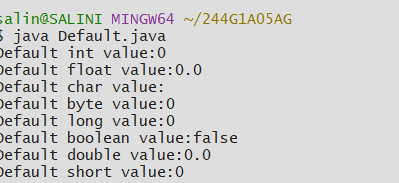

## Experiment1
# TITLE 1a) display the primitive datatypes
```java
public class Default {
 int i;
 float f;
 char ch;
 byte b;
 long l;
 short s;
 boolean e;
 double d;
 public static void main(String args[])
 {
  Default obj=new Default();
  System.out.println("Default int value:" +obj.i); 
  System.out.println("Default float value:" +obj.f);
  System.out.println("Default char value:" +obj.ch);
  System.out.println("Default byte value:" +obj.b);  
  System.out.println("Default long value:" +obj.l);
  System.out.println("Default boolean value:" +obj.e);
  System.out.println("Default double value:" +obj.d);
  System.out.println("Default short value:" +obj.s);
 }
}
```
# output

